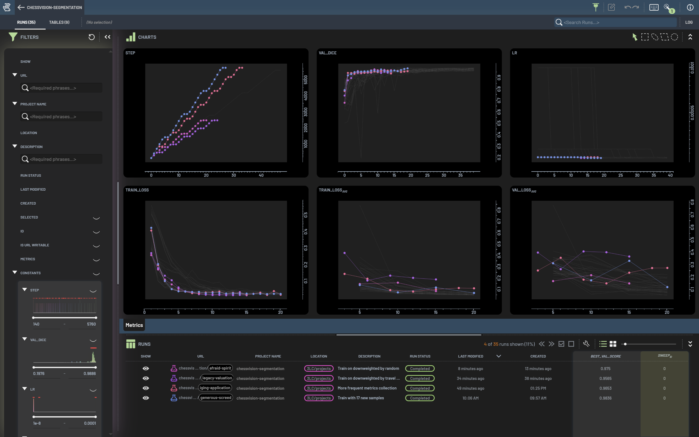
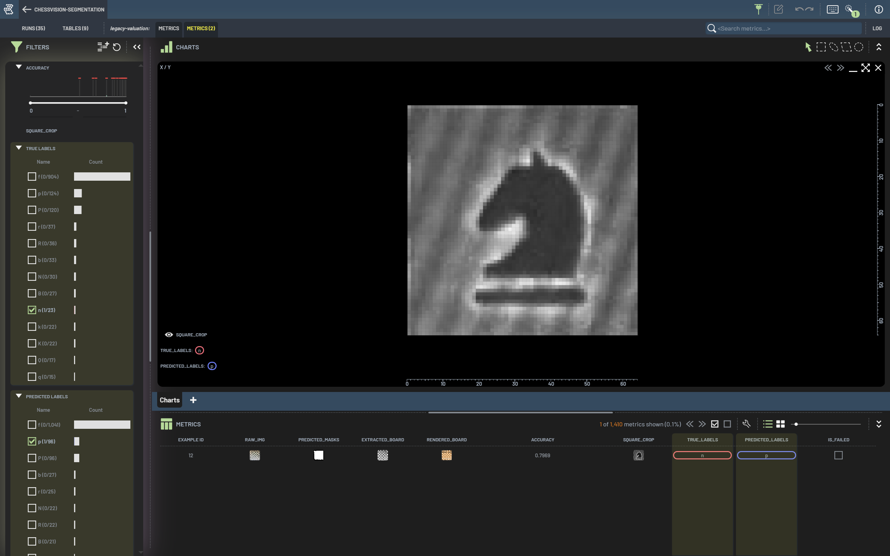
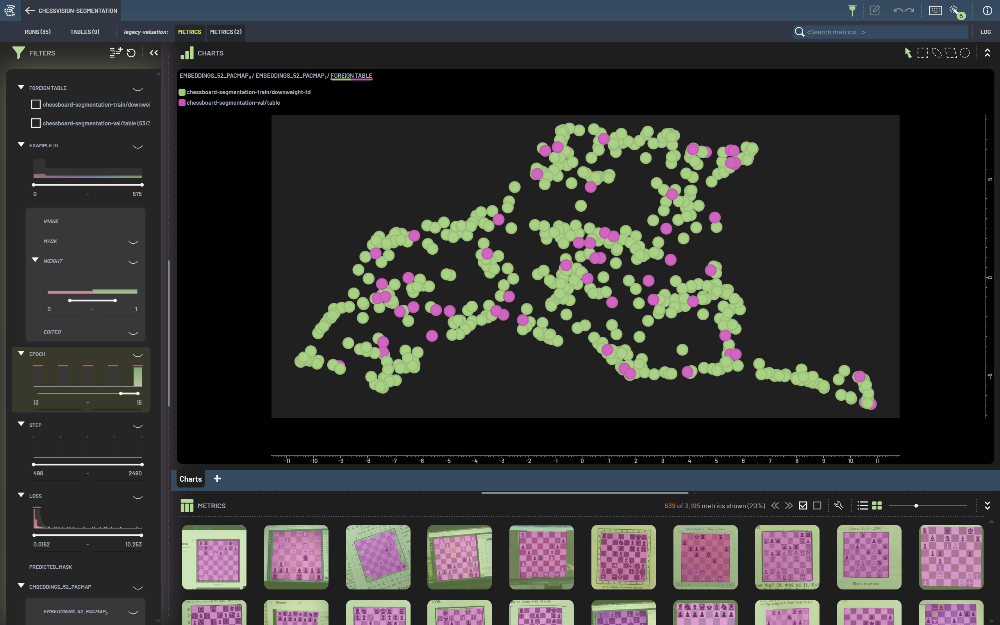
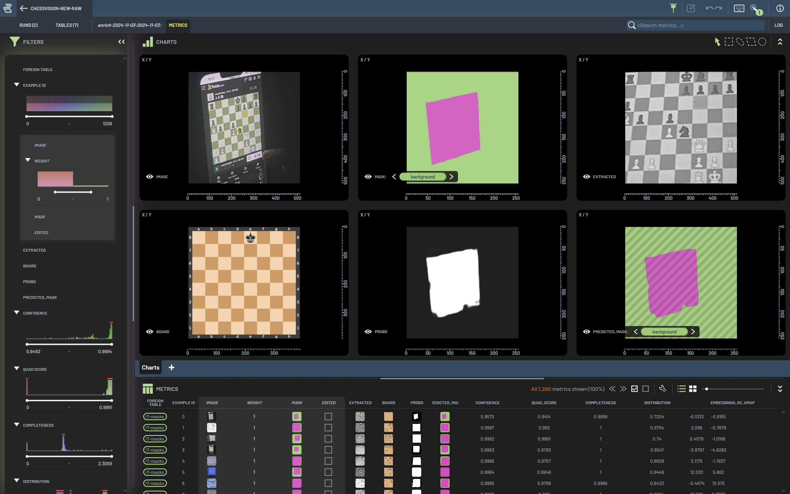
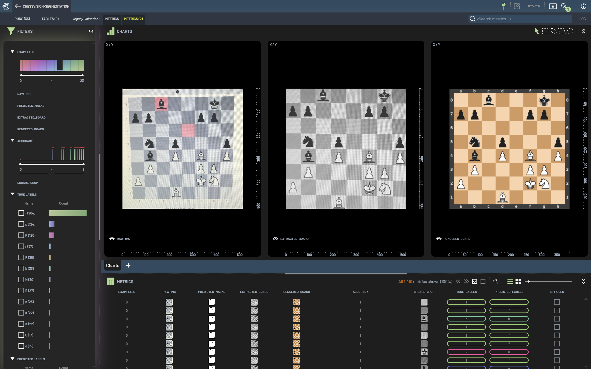

# ChessVision

Welcome to ChessVision: a computer vision system for detecting and classifying chess positions from images of 2D chessboards.
The system uses deep learning models to segment chessboards and classify chess pieces.

This project is an evolution of the original [ChessVision](https://github.com/ChessVision/ChessVision),
reimagined with the [3LC](https://3lc.ai) ecosystem in mind. It features a complete rewrite from Keras to PyTorch
and a thorough modernization of the codebase, as well as integration with 3LC throughout the pipeline.

## Motivation

While detecting chess positions is certainly useful (and something I personally enjoy!),
this project serves a broader purpose as my experimental playground for exploring
machine learning systems end-to-end. It's where I learn, practice, and have fun
working with:

- Data collection and annotation
- Model training and evaluation
- Performance monitoring and analysis
- ML-powered web application development

ChessVision has become my ideal testbed for tackling these challenges. While there
might be more optimal solutions to specific problems, the real value lies in the
patterns and abstractions I discover along the way. Recently, I've also started
using it to develop and test features for the [3LC](https://3lc.ai) data platform,
which I build with my team at 3lc.ai.

## Features

- Chessboard detection and segmentation using a UNet model
- Chess piece classification using a deep learning model
- REST API for image processing and position analysis
- Web interface for uploading and analyzing chess images

## Project Structure

- `chessvision/`: The core computer vision code
- `scripts/`: Scripts for training and evaluating the models
- `app/`: Code for a development Flask web application and compute server
- `data/`: Training and evaluation datasets
- `weights/`: Pre-trained models
- `tests/`: Unit tests for the computer vision code

## Getting Started

- Checkout this repo.
- Ensure submodules are checked out: `git submodule update --init`
- Create a virtual environment: `python -m venv .venv`
- Activate the virtual environment: `source .venv/bin/activate`
- Install dependencies: `pip install -e .`
- Set up 3LC: [3LC Quickstart](https://docs.3lc.ai/3lc/latest/quickstart/quickstart.html)

## Examples

### Quick Start

For a quick end-to-end overview of the system, run the Jupyter notebook:

```bash
jupyter notebook examples/quickstart-example.ipynb
```

### Detailed Pipeline

For a detailed breakdown of each step in the pipeline, run the Python script:

```bash
python examples/detailed-example.py
```

## Training

See launch configurations in `.vscode/launch.json` for training the models and
running the web application.

## The ChessVision Solution

The chessvision solution consists of several steps:

1. Board detection using a UNet model to segment the chessboard from the background
2. Contour detection and filtering to identify the chessboard boundaries
3. Perspective transform to extract the chessboard
4. Individual square extraction
5. CNN-based piece classification
6. Chess position validation and final output (FEN string)

For more details on the original approach, see the [old README](https://github.com/gudbrandtandberg/ChessVision?tab=readme-ov-file#algorithm-details)

## Datasets

The repo comes with three original datasets checked in:

- `board_extraction`: A dataset of chessboard images with annotated segmentation masks.
- `squares`: A dataset of chess piece images with annotated classification labels.
- `test`: A set of test images and ground truth files for evaluating the model.

In addition, there is a practically endless supply of new data collected through a friend's chess app, which I have in a private S3 bucket.

## 3LC and the ML Lifecycle

### Training the board extractor



### Training the piece classifier



### Process new raw data





### Run evaluation suite


