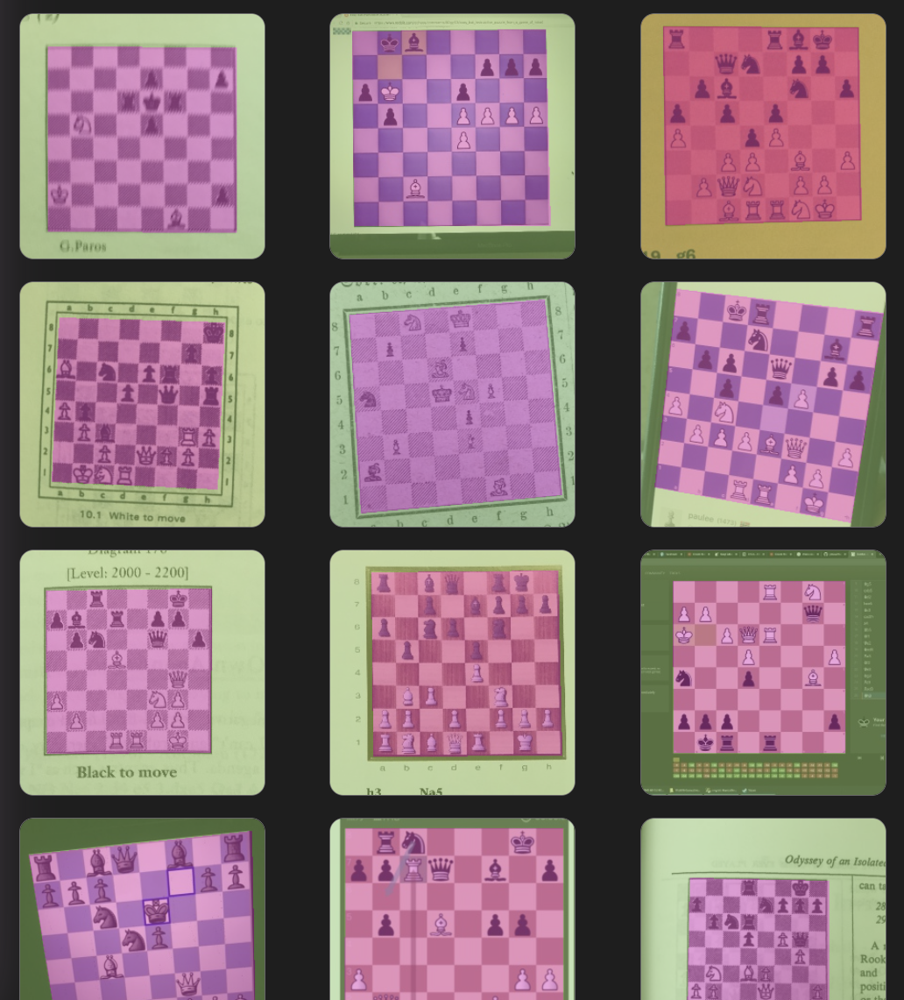
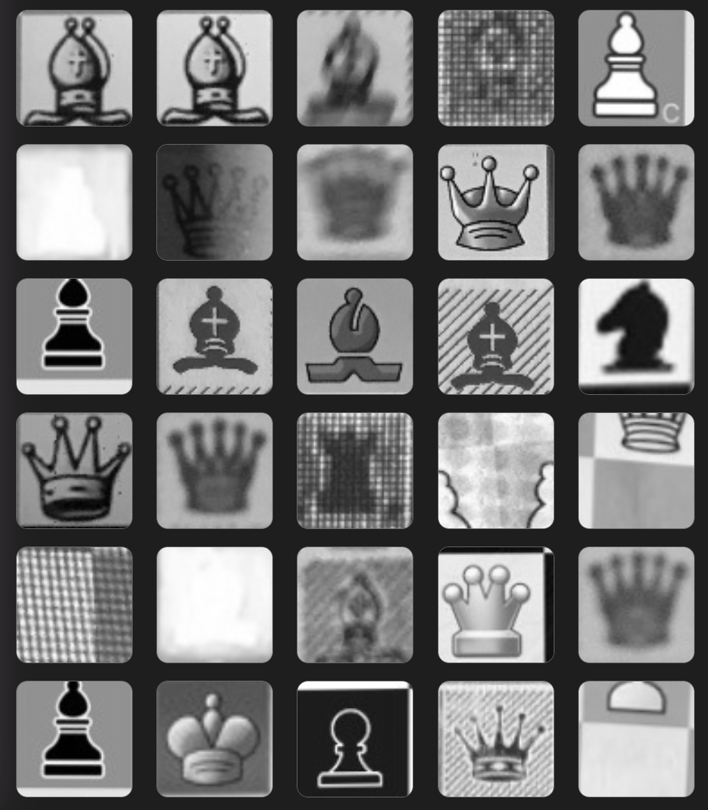
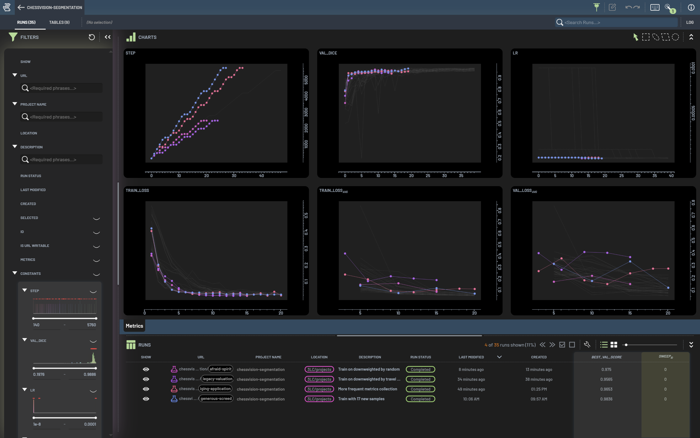
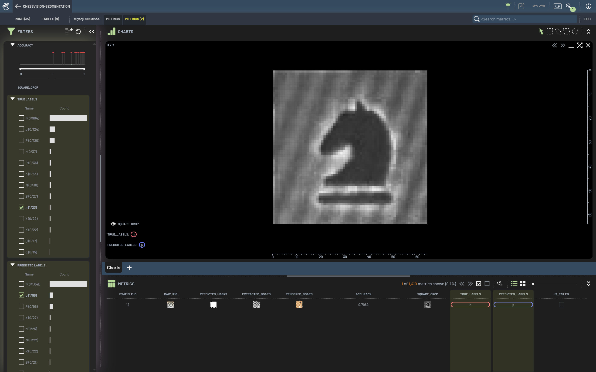
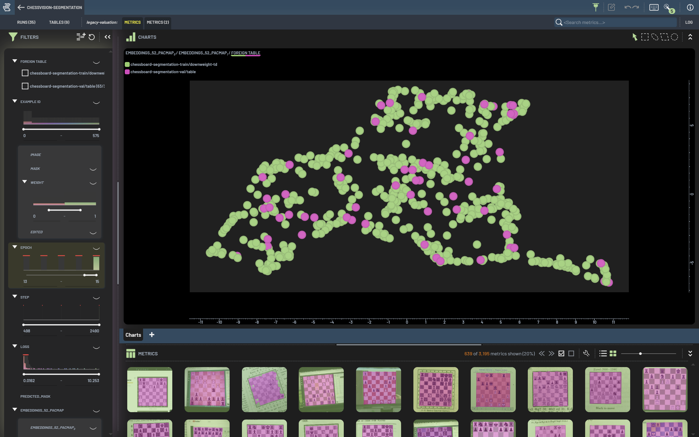
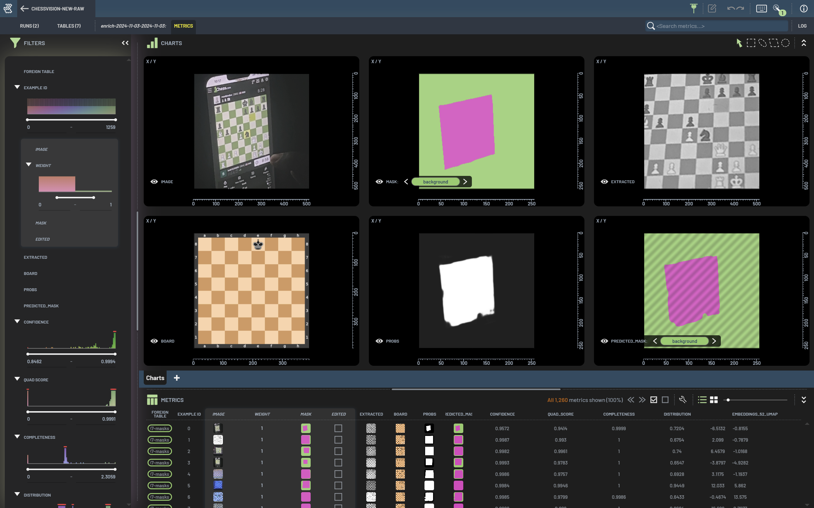
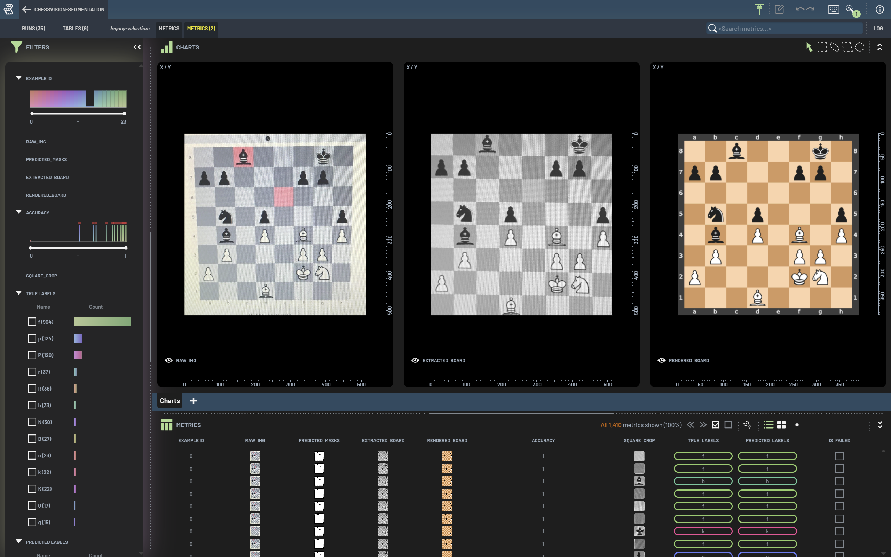

# ChessVision

Welcome to ChessVision: a computer vision system for detecting and classifying chess positions from images of 2D chessboards.
The system uses deep learning models to segment chessboards and classify chess pieces.

|  |  |
|---|---|
|  |  |

This project is an evolution of the original [ChessVision](https://github.com/gudbrandtandberg/ChessVision),
reimagined with the [3LC](https://3lc.ai) integrated in all stages of the pipeline. It also features a complete rewrite in PyTorch and a thorough upgrade of the codebase.

## Motivation

While detecting chess positions is certainly useful (and something I personally enjoy!),
this project serves a broader purpose as my experimental playground for exploring
machine learning systems. It's where I learn, practice, and have fun
working with:

- Data collection and annotation
- Model training and evaluation
- Performance monitoring and analysis

The [3LC](https://3lc.ai) data platform, built by the incredible team at 3LC AI, serves as a perfect tool and companion in solving many challenges, such as data selection (using metrics analysis and dataset lineage), model-assisted labeling (using the powerful 3LC Dashboard web application), evaluating and tracking model performance over time, fine tuning the training data using sample weights (resulting in faster convergence and shorter training time), and many more.

## Features

- Chessboard extraction with a YOLO segmentation model (UNet fallback)
- Chess piece classification with a YOLO model (timm-based fallback)
- API for image processing
- Web interface for uploading and analyzing chess images

## Project Structure

- `chessvision/`: The core computer vision code
- `scripts/`: Scripts for training and evaluating the models
- `app/`: Code for a development Flask web application and compute server
- `data/`: Training and evaluation datasets
- `weights/`: Trained models — the two best YOLO models (`best_yolo_extractor.pt`, `best_yolo_classifier.pt`) are committed (AGPL-3.0), so inference works on a fresh clone
- `tests/`: Unit tests for the computer vision code

## Installation

### 1. Clone the Repository

```bash
# Clone the repo
git clone https://github.com/gudbrandtandberg/ChessVision-3LC.git
cd ChessVision-3LC

# Initialize and update the pytorch-unet submodule
git submodule update --init
```

### 2. Install dependencies

Everything installs from **public packages** — no special access required. The YOLO and 3LC
integrations (`3lc-ultralytics`, `3lc`) come from the public 3LC package index automatically.
[`uv`](https://docs.astral.sh/uv/) is recommended:

```bash
# Install uv (macOS/Linux); Windows: https://github.com/astral-sh/uv#installation
curl -LsSf https://astral.sh/uv/install.sh | sh

uv sync                 # core deps (YOLO + 3LC)
uv sync --all-extras    # also pulls the viz (plotly) and boto (S3) extras
```

<details><summary>Alternative: venv + pip</summary>

```bash
python -m venv .venv && source .venv/bin/activate
pip install -e ".[viz,boto]"
```
</details>

### 3. Get a 3LC API key (free)

3LC is integrated throughout the pipeline. A **free single-user account** unlocks everything —
training, evaluation, and the 3LC Dashboard:

1. Sign up and copy your key at [account.3lc.ai](https://accounts.3lc.ai).
2. Authenticate, then verify:
   ```bash
   3lc login <your-api-key>   # or: export TLC_API_KEY=<your-api-key>
   3lc --version
   ```

> Contributors with access to the 3LC source can run **fully offline** (account service
> disabled, no key). See [CONTRIBUTING.md](CONTRIBUTING.md) for that and other setups.

## Verify Installation

```bash
# Run a simple test to verify everything is working
python -c "from chessvision import ChessVision; print('Installation successful!')"

# Verify PyTorch installation
python -c "import torch; print('CUDA available:', torch.cuda.is_available())"

# Check if mps is available
python -c "import torch; print('MPS available:', torch.backends.mps.is_available())"

# Run tests (the committed weights are used automatically)
pytest tests/
```

## Examples

**Note:** The committed YOLO weights in `weights/` are used by default, so the examples run on a fresh clone. To train your own, see the [Training](#training) section.

### Quick Start

For a quick overview of the system, run the Jupyter notebook:

```bash
code examples/quickstart-example.ipynb
```

### Detailed Pipeline

For a detailed breakdown of each step in the pipeline, run the Python script:

```bash
python examples/detailed-example.py
```

## Training

Main scripts for training and evaluating the models are located in the `scripts/` directory.

```bash
# Train the YOLO board extractor (recommended)
./scripts/bin/train_yolo_board_extractor.sh

# Or the fallback (non-YOLO / UNet) board extractor
./scripts/bin/train_board_extractor.sh

# Train the YOLO classifier (recommended)
./scripts/bin/train_yolo_classifier.sh

# Or the fallback (non-YOLO) classifier
./scripts/bin/train_classifier.sh

# Now that we have trained models, we can run the evaluation suite
./scripts/bin/evaluate.sh
```

All models usually take less than 10 minutes to train on a modern GPU.

See additional launch configurations in `.vscode/launch.json` for training the models and
running the web application.

### Extra: a more challenging test set

The `scripts/merge_new_raw/merge_new_test.py` script merges a new batch of raw data into the test set. In order to run it, the initial test table must have been created, e.g. by running the evaluation suite once. Uncomment the `table_name` argument in `evaluate.sh` to run the evaluation suite against the latest test set.

```bash
python scripts/merge_new_raw/merge_new_test.py
```

## The ChessVision Solution

The chessvision solution consists of several steps:

1. Board extraction using a YOLO segmentation model to segment the chessboard from the background (UNet fallback)
2. Contour detection and filtering to identify the chessboard boundaries
3. Perspective transform to extract the chessboard
4. Individual square extraction
5. CNN-based piece classification
6. Chess position validation and final output (FEN string)

For more details on the original approach, see the [old README](https://github.com/gudbrandtandberg/ChessVision?tab=readme-ov-file#algorithm-details)

## Datasets

The repo comes with three original datasets checked in:

- `board_extraction`: A dataset of chessboard images with annotated segmentation masks.
- `squares`: A dataset of chess piece images with annotated classification labels.
- `test`: A set of test images with ground truth files for evaluating the model.

In addition, there is a practically endless supply of new data collected through a friend's chess app, which I have in a private S3 bucket.

## 3LC and the ML Lifecycle

### Training the board extractor



### Training the piece classifier



### Process new raw data





### Run evaluation suite



## Contributing

Contributions are welcome. [CONTRIBUTING.md](CONTRIBUTING.md) covers the setup tiers
(public wheels + free key, fully-offline source overlay, and the no-3LC inference-only
escape hatch) and the macOS / Linux-CUDA platform notes.

## License

This project is licensed under the **GNU Affero General Public License v3.0** (AGPL-3.0) — see [LICENSE](LICENSE). This includes the trained model weights in `weights/`, which are fine-tuned from [Ultralytics YOLO](https://github.com/ultralytics/ultralytics) (itself AGPL-3.0); see [NOTICE](NOTICE) for attribution.

If you run this as a network service, AGPL-3.0 requires you to make your complete corresponding source available to your users. For commercial/proprietary use without that obligation, you would need an Ultralytics Enterprise License.

Please credit this project if you build on it.
